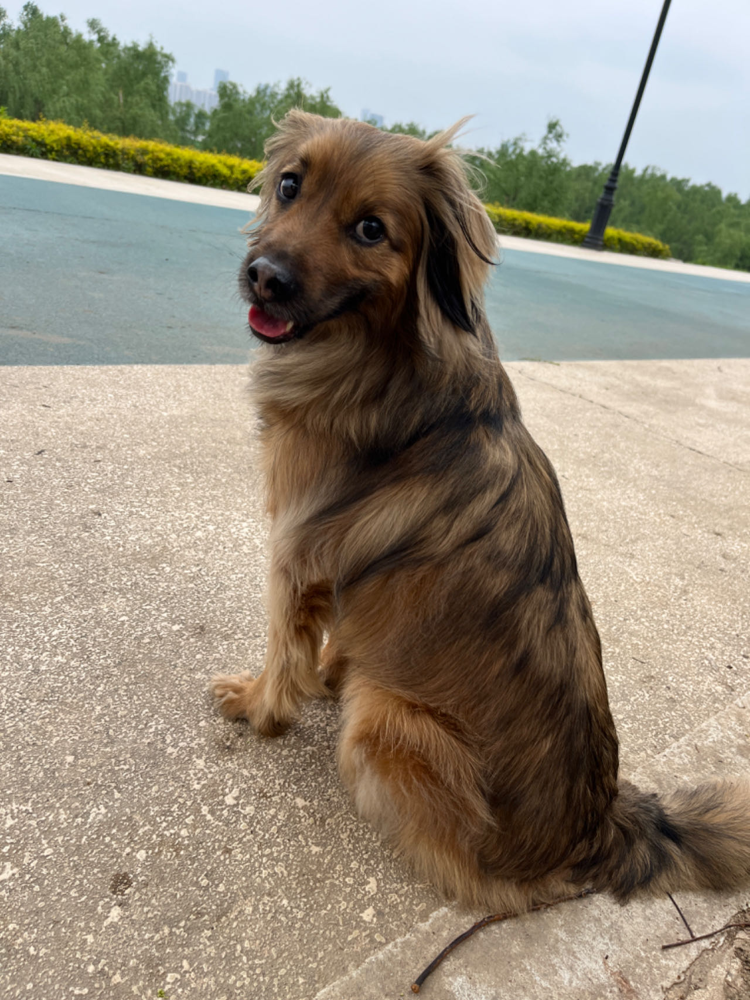

阿木（约2019年3月27日—2026年2月23日），武汉市小动物保护协会会长家的狗下的崽，在2019年5月11日被狗主在领养活动上挑中，此后与<a href="https://yuanfan.rbind.io/">狗主</a>共同生活近七年，最终因肾脏、肺部恶性肿瘤离世。

<blockquote style="margin: 0 0 1.5rem 0; padding: 0.62rem 0.8rem; border-left: 4px solid var(--secondary); background: rgba(210,150,80,0.08); border-radius: 8px; color: var(--darkgray); line-height: 1.58; font-style: italic; font-size: 1.02em; font-weight: 600;">
阿木：真希望能够永永远远和狗主一起生活呀……
</blockquote>

<h2 style="margin-top: 0;">档案目录</h2>

- [阿木的性格](./01-阿木的性格) — 阿木的脾气、习惯、小个性
- [阿木与狗主](./02-阿木与狗主) — 人与狗之间的爱和默契
- [阿木的朋友圈](./03-阿木的朋友圈) — 阿木与其他狗狗的故事
- [狗闻狗事](./04-狗闻狗事) — 遛狗路上的见闻与社会百态
- [生病与告别](./05-生病与告别) — 阿木的病情与最后的时光
- [照片与视频](./照片与视频) — 阿木的影像记录与相册

狗故事整理进度

- [x] 《白雪歌》评论
- [x] 《信徒》评论
- [x] 《狗闻》
- [x] 《阿木狗的脾气》
- [x] 《简单小狗》
- [ ] 待定

